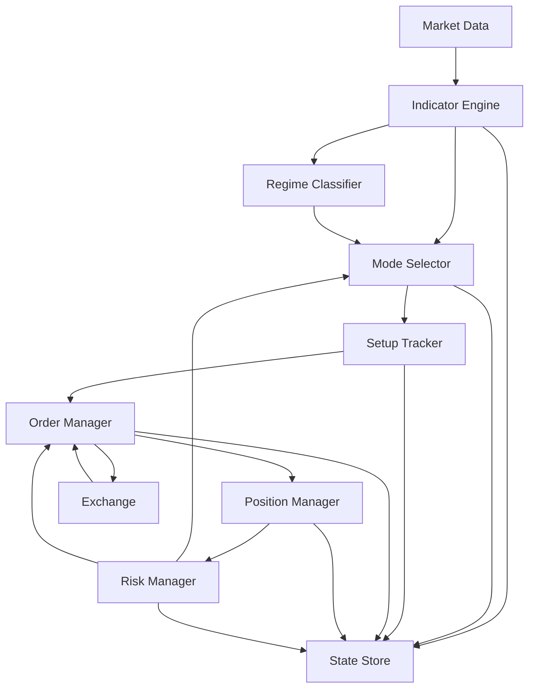

# 자동매매 상태머신 설계도

기준 문서: [coin_strategy_spec_v2.md](./coin_strategy_spec_v2.md)

이 문서는 기존 전략 명세를 실제 구현 가능한 상태머신으로 재구성한 설계안이다. 핵심 목표는 "진입 규칙 나열"이 아니라, 실시간 데이터 수신, 모드 판정, 주문 집행, 포지션 관리, 장애 복구를 예측 가능하게 만드는 것이다.

## 1. 설계 목표

- `ETHUSDT Perp`, `BTCUSDT Perp` 기준으로 동작한다.
- 멀티 타임프레임 판단은 `4h / 1h / 30m / 15m / 5m` 종가 기준으로만 확정한다.
- 상위 구조 판정과 하위 실행 상태를 분리한다.
- 전략 모드와 포지션 수명주기를 분리한다.
- 실시간 장애, 주문 실패, 부분 체결, 재기동 복구를 상태로 관리한다.

## 2. 핵심 가정

- 한 계정에서 복수 심볼(`ETHUSDT Perp`, `BTCUSDT Perp`)을 거래한다.
- 각 심볼은 독립적인 상태머신 인스턴스를 가진다. 심볼 간 상태는 공유하지 않는다.
- `RiskGate`와 `EngineState`는 계정 수준(글로벌)으로, 모든 심볼에 동일하게 적용한다.
- `RegimeState`, `ModeState`, `SetupState`, `TradeLifecycleState`는 심볼별로 독립 관리한다.
- 반대 방향 포지션 동시 보유는 같은 심볼 내에서 금지한다. 다른 심볼 간에는 허용한다 (예: ETHUSDT 롱 + BTCUSDT 숏).
- 동일 방향 분할 진입은 허용하되, 논리적으로는 하나의 집계 포지션으로 관리한다.
- 전략 판정은 봉 마감 이벤트에서만 바뀌고, 체결/손절/익절은 주문 이벤트로 별도 처리한다.
- 지지/저항은 단일 숫자가 아니라 존으로 다룬다.
- 동시 총 위험 노출은 모든 심볼의 합산 기준으로 계산한다.

## 3. 왜 다층 상태머신인가

기존 명세는 충분히 구체적이지만, 그대로 코드화하면 아래 문제가 생긴다.

- "지금 거래 가능한가"와 "지금 어떤 전략 모드인가"가 섞이기 쉽다.
- "진입을 기다리는 상태"와 "포지션을 들고 관리하는 상태"가 섞이면 버그가 난다.
- 실시간 장애와 전략 무효화가 한 함수 안에서 뒤엉키면 재기동 복구가 어렵다.

따라서 상태를 아래 5개 축으로 분리한다.

1. `EngineState`: 시스템이 거래 가능한 기술 상태인가
2. `RiskGate`: 현재 리스크 기준상 거래 허용인가
3. `RegimeState`: 상위 구조가 강세/중립/약세인가
4. `ModeState`: 현재 어떤 전략 모드가 허용되는가
5. `TradeLifecycleState`: 진입 대기부터 청산 후 쿨다운까지 어디에 있는가

## 4. 전체 구조



구현 관점에서는 "심볼당 하나의 직렬 이벤트 루프"를 둔다. 여러 타임프레임 이벤트와 주문 이벤트가 동시에 들어와도, 각 심볼의 최종 상태 전이는 항상 한 줄로 직렬 처리해야 한다. 심볼 간 이벤트 루프는 독립적으로 동작하되, `RiskGate`와 `EngineState` 갱신은 글로벌 락으로 보호한다.

## 5. 상태 정의

### 5.1 EngineState

| 상태 | 의미 | 진입 조건 | 이탈 조건 |
| --- | --- | --- | --- |
| `BOOTSTRAPPING` | 프로세스 시작, 저장 상태 로드 전 | 프로세스 시작 | 스냅샷 로드 완료 |
| `WARMUP` | 히스토리/지표 준비 중 | 최소 히스토리 부족, 재기동 직후 재동기화 | 모든 타임프레임 최소 바 수 확보 + 지표 계산 완료 |
| `READY` | 전략 평가와 주문 집행 가능 | 데이터 정상, 주문 API 정상, 상태 정합성 확보 | 피드 단절, API 장애, 정합성 오류, 수동 중단 |
| `DEGRADED` | 데이터는 일부 살아 있으나 거래 금지 | 피드 지연, 주문 API 불안정, 체결 정합성 의심 | 복구 후 재정합성 확인 시 `READY`, 치명적이면 `HALTED` |
| `HALTED` | 신규 거래와 자동 재진입 전면 중단 | 킬 스위치, 리스크 중단, 중대 정합성 오류 | 운영자 승인 + 재동기화 완료 후 `WARMUP` |

### 5.2 RiskGate

| 상태 | 의미 | 기준 |
| --- | --- | --- |
| `ALLOW` | 정상 크기 거래 허용 | 손실/슬리피지/API 상태 정상 |
| `REDUCE` | 축소 거래만 허용 | 변동성 확대, 역추세 숏, 경고 수준 손실 |
| `BLOCK` | 신규 거래 차단 | 연속 4손실, 일일 -3R 이하, API 실패 누적, 슬리피지 급증 |

`RiskGate`는 `EngineState`와 별개다. 예를 들어 시스템은 기술적으로 `READY`지만, 리스크 규칙 때문에 `BLOCK`일 수 있다.

### 5.3 RegimeState

| 상태 | 의미 | 판정 기준 |
| --- | --- | --- |
| `HTF_BULLISH` | 4시간 상위 구조 강세 | `4h.close > cloud_top`, `tenkan > kijun`, `profile_bias != below_va` |
| `HTF_NEUTRAL` | 상위 구조 중립 | 4시간 구름 안, 구름 상단 근처 흔들림, 상단 거절 반복 |
| `HTF_BEARISH` | 4시간 상위 구조 약세 | `4h.close < cloud_bottom`, `tenkan < kijun`, `profile_bias == below_va` |

이 상태는 `4h` 봉 마감 시점에만 변경한다.

### 5.4 ModeState

| 상태 | 의미 | 핵심 조건 |
| --- | --- | --- |
| `MODE_TREND_LONG` | 강한 상위 추세 내 눌림 후 재상승 롱 | 4h 강세, 1h 강세/중립, 30m above_cloud + TK 강세 |
| `MODE_PULLBACK_LONG` | 상위 강세 유지 중 깊은 조정 매수 | 4h 강세, 1h 중립/구름 안, 30m/15m 조정, 핵심 지지 접근 |
| `MODE_REBOUND_SHORT` | 하위 약세 정렬에서 반등 실패 숏 | 4h 중립/약세 또는 강세 약화, 1h/30m/15m 약세 정렬 |
| `MODE_NO_TRADE` | 거래 회피 | 방향 충돌, 박스 중앙, RR 부족, 이벤트 리스크, 과열 |

이 상태는 `30m` 봉 마감 시점에 재계산한다. 단, `EngineState != READY` 또는 `RiskGate == BLOCK`이면 강제로 `MODE_NO_TRADE` 취급한다.

### 5.5 SetupState

| 상태 | 의미 | 설명 |
| --- | --- | --- |
| `IDLE` | 감시 중인 유효 셋업 없음 | 새 존 선택 전 |
| `WAIT_ZONE_TOUCH` | 지지/저항 존 도달 대기 | 전략 모드는 유효하지만 가격 미도달 |
| `WAIT_TRIGGER_CONFIRM` | 하위 타임프레임 반전 확인 대기 | 존 터치 후 15m/5m 트리거 대기 |
| `ENTRY_READY` | 주문 제출 가능 | 트리거, 거래량, RR, 무효화 미발생 충족 |
| `INVALIDATED` | 이번 아이디어 폐기 | 존 하단/상단 이탈, 모드 붕괴, RR 악화 |

### 5.6 TradeLifecycleState

| 상태 | 의미 | 설명 |
| --- | --- | --- |
| `FLAT` | 포지션 없음 | 진입 가능 상태 |
| `ENTRY_WORKING` | 진입 주문 접수 후 체결 대기 | 분할 진입 주문 포함 |
| `OPEN_STAGE0` | 초기 진입 후 TP1 전 | 손절과 1차 목표 감시 |
| `OPEN_STAGE1` | 1차 익절 후 잔량 보유 | 트레일링 강화 |
| `OPEN_STAGE2` | 2차 익절 후 잔량 보유 | 잔량 추세 추종 |
| `EXIT_WORKING` | 청산 주문 처리 중 | 손절, 전량 청산, 강제 청산 포함 |
| `COOLDOWN` | 동일 방향 재진입 제한 | 재진입 쿨다운 종료 전 |

## 6. 상태머신 연결 원칙

- `EngineState`가 `READY`가 아니면 신규 진입 로직을 평가하지 않는다.
- `RiskGate == BLOCK`이면 `ModeState`를 내부적으로 `MODE_NO_TRADE`로 강등한다.
- `ModeState`는 "무엇을 할 수 있는가"를 결정하고, `TradeLifecycleState`는 "지금 실제로 무엇을 하고 있는가"를 결정한다.
- 포지션 보유 중에는 모드가 바뀌더라도 즉시 반대 포지션으로 뒤집지 않는다.
- 반대 방향 진입은 `TradeLifecycleState == FLAT` 이고 `COOLDOWN` 종료 후에만 허용한다.
- `EngineState == DEGRADED` 시 기존 포지션 관리 정책:
  - 기존 보호 손절 주문은 유지한다 (수정/취소하지 않는다).
  - 트레일링 스탑 조정을 중단한다.
  - TP 지정가 주문은 거래소에 이미 제출된 상태이므로 그대로 둔다.
  - DEGRADED 중 TP1_FILLED/TP2_FILLED/STOP_FILLED 이벤트가 발생하면, 복구 후 `DEGRADED → READY` 전환 시 거래소 포지션 재조정에서 일괄 처리한다.
  - 신규 주문 제출, 주문 수정을 시도하지 않는다.

## 7. 이벤트 모델

상태 전이는 아래 이벤트만으로 발생시킨다.

- `BOOT_COMPLETED`
- `HISTORY_READY`
- `BAR_CLOSED_4H`
- `BAR_CLOSED_1H`
- `BAR_CLOSED_30M`
- `BAR_CLOSED_15M`
- `BAR_CLOSED_5M`
- `ZONE_TOUCHED`
- `TRIGGER_CONFIRMED`
- `TRIGGER_INVALIDATED`
- `ENTRY_ORDER_SUBMITTED`
- `ENTRY_ORDER_PARTIAL_FILL`
- `ENTRY_ORDER_FILLED`
- `STOP_ORDER_ATTACHED`
- `TP1_FILLED`
- `TP2_FILLED`
- `STOP_FILLED`
- `EXIT_ORDER_FILLED`
- `API_DEGRADED`
- `API_RECOVERED`
- `RISK_LIMIT_BREACHED`
- `MANUAL_HALT`
- `MANUAL_RESUME`

중요한 점은, "봉 마감 이벤트"와 "주문 이벤트"를 섞어 즉시 판정하지 않는 것이다. 봉 마감은 전략 판단용, 주문 이벤트는 집행 상태용이다.

## 8. 전략 모드별 셋업 매핑

### 8.1 `MODE_TREND_LONG`

- 감시 존: `30m Tenkan`, `1h Tenkan`
- 존 도달 조건: 가격이 해당 존에 접근
- 트리거 조건:
  - 5분 아래꼬리 또는 직전 저점 갱신 실패
  - 15분 종가가 반등 레벨 회복
  - 반등 봉 거래량이 직전 5개 평균 이상
- 무효화:
  - 사용 지지 존 하단 아래 15분 종가 확정
  - 30m/15m/5m 동시 약세 정렬

### 8.2 `MODE_PULLBACK_LONG`

- 감시 존: `30m Kijun`, `1h Kijun`, `30m POC`, `30m VAL`, `1h POC`, `1h VAL`, `4h Kijun`
- 존 도달 조건: 핵심 지지 존 도달
- 트리거 조건:
  - 15분 하단 이탈 실패 또는 반전 캔들
  - 5분 고점이 직전 3개 봉 최고가 돌파
  - 15분 거래량 증가
  - 30분 종가 기준 지지 존 유지/회복
- 무효화:
  - 15분 종가 기준 지지 붕괴
  - 1시간 종가 기준 상위 지지 붕괴

### 8.3 `MODE_REBOUND_SHORT`

- 감시 존: `15m Kijun`, `30m Tenkan`, `30m Kijun`, `30m VAH`, `30m POC`, `1h Tenkan`
- 존 도달 조건: 급락 후 기술적 반등이 저항 존 접근
- 트리거 조건:
  - 5분 윗꼬리 + 음봉 전환
  - 15분이 저항 아래에서 마감
  - 재하락 거래량이 반등 거래량보다 강함
- 무효화:
  - 저항 존 상단 위 15분 종가 확정
  - 30분 구름 위 + TK 강세 복귀
  - 1시간이 POC/VAH 위 회복

## 9. 전이 규칙

### 9.1 EngineState 전이

```text
BOOTSTRAPPING -> WARMUP
  when 저장 상태 로드 완료

WARMUP -> READY
  when 모든 타임프레임 최소 바 수 확보
   and 지표 계산 성공
   and 거래소 시계/포지션/주문 정합성 확인

READY -> DEGRADED
  when 피드 끊김
   or 주문 API 불안정
   or 로컬 상태와 거래소 상태 불일치

DEGRADED -> READY
  when 피드 복구
   and 미체결 주문/포지션 재조정 완료

ANY -> HALTED
  when 수동 중단
   or RiskGate == BLOCK and 정책상 자동 중단
   or 보호 주문 유실

HALTED -> WARMUP
  when 운영자 재개 승인
   and 재동기화 시작
```

### 9.2 SetupState 전이

```text
IDLE -> WAIT_ZONE_TOUCH
  when ModeState in {MODE_TREND_LONG, MODE_PULLBACK_LONG, MODE_REBOUND_SHORT}
   and 감시 존 생성 완료

WAIT_ZONE_TOUCH -> WAIT_TRIGGER_CONFIRM
  when 가격이 감시 존 터치

WAIT_TRIGGER_CONFIRM -> ENTRY_READY
  when 하위 타임프레임 트리거 충족
   and 거래량 필터 통과
   and RR >= 1.5

WAIT_ZONE_TOUCH -> INVALIDATED
WAIT_TRIGGER_CONFIRM -> INVALIDATED
ENTRY_READY -> INVALIDATED
  when 모드 붕괴
   or 존 하단/상단 이탈
   or 이벤트 리스크 발생

INVALIDATED -> IDLE
  when 새 30m 평가 주기 시작
```

### 9.3 TradeLifecycleState 전이

```text
FLAT -> ENTRY_WORKING
  when ENTRY_READY
   and EngineState == READY
   and RiskGate in {ALLOW, REDUCE}
   and 반대 포지션 없음 (같은 심볼 내)
   and globalState.totalRiskExposurePct + globalState.pendingRiskPct + candidateRiskPct <= maxTotalRisk
   and 심볼별 위험 노출 + candidateRiskPct <= maxSymbolRisk
  action: globalState.pendingRiskPct += candidateRiskPct (전체 의도 포지션 기준)

ENTRY_WORKING -> OPEN_STAGE0
  when 첫 체결 확인
   and 초기 손절 주문 부착 완료
  action: globalState.totalRiskExposurePct += 체결분 리스크, globalState.pendingRiskPct -= 체결분 리스크

ENTRY_WORKING -> FLAT
  when 주문 취소/만료
   and 체결 수량 0
  action: globalState.pendingRiskPct -= 예약분 전액 반납

ENTRY_WORKING -> EXIT_WORKING
  when 부분 체결 후 셋업 무효화
   or 보호 주문 부착 실패
  action: globalState.pendingRiskPct -= 미체결 잔여 예약분 반납

OPEN_STAGE0 -> OPEN_STAGE1
  when TP1 체결

OPEN_STAGE1 -> OPEN_STAGE2
  when TP2 체결

OPEN_STAGE0 -> EXIT_WORKING
OPEN_STAGE1 -> EXIT_WORKING
OPEN_STAGE2 -> EXIT_WORKING
  when 손절 체결
   or 무효화 강제 청산
   or 수동 청산
   or HALTED 진입

EXIT_WORKING -> COOLDOWN
  when 포지션 수량 0 확인
   and 미체결 주문 정리 완료

COOLDOWN -> FLAT
  when 재진입 제한 시간 또는 제한 바 수 종료
```

## 10. 상태 평가 우선순위

실시간 루프는 아래 순서로만 평가한다.

1. `EngineState` 이상 여부 확인
2. `RiskGate` 갱신
3. 거래소 포지션/주문 정합성 확인
4. 봉 마감 이벤트가 있으면 `RegimeState`와 `ModeState` 갱신 (동일 틱에 멀티 타임프레임 봉 마감이 동시 도착하면 `4H → 1H → 30M → 15M → 5M` 순서로 처리)
5. 현재 셋업 무효화 여부 확인
6. 포지션이 있으면 청산 로직 우선 처리
7. 포지션이 없으면 새 셋업 추적 및 진입 처리
8. 상태 전이 로그 저장

이 순서를 지키면 "모드가 바뀌는 순간 포지션 관리가 누락되는 문제"를 막을 수 있다.

## 11. 핵심 불변조건

- `TradeLifecycleState != FLAT` 이면 반드시 보호 손절 가격이 존재해야 한다.
- 반대 방향 주문과 포지션은 동시에 존재할 수 없다.
- `ENTRY_READY` 상태라도 `EngineState != READY` 면 주문을 내지 않는다.
- `ModeState`는 봉 마감에서만 바뀌며 틱 단위로 뒤집지 않는다.
- 모든 상태 전이는 `reason`, `snapshot_version`, `bar_timestamp`를 남긴다.
- 동일 `setup_version`에 대해 중복 주문 제출은 1회만 허용한다.
- 재기동 후 로컬 상태와 거래소 실포지션이 다르면 즉시 `DEGRADED` 또는 `HALTED`로 간다.

## 12. 데이터 모델 제안

```ts
type EngineState =
  | 'BOOTSTRAPPING'
  | 'WARMUP'
  | 'READY'
  | 'DEGRADED'
  | 'HALTED';

type RiskGate = 'ALLOW' | 'REDUCE' | 'BLOCK';

type RegimeState = 'HTF_BULLISH' | 'HTF_NEUTRAL' | 'HTF_BEARISH';

type ModeState =
  | 'MODE_TREND_LONG'
  | 'MODE_PULLBACK_LONG'
  | 'MODE_REBOUND_SHORT'
  | 'MODE_NO_TRADE';

type SetupState =
  | 'IDLE'
  | 'WAIT_ZONE_TOUCH'
  | 'WAIT_TRIGGER_CONFIRM'
  | 'ENTRY_READY'
  | 'INVALIDATED';

type TradeLifecycleState =
  | 'FLAT'
  | 'ENTRY_WORKING'
  | 'OPEN_STAGE0'
  | 'OPEN_STAGE1'
  | 'OPEN_STAGE2'
  | 'EXIT_WORKING'
  | 'COOLDOWN';

// 심볼별 독립 상태
interface SymbolState {
  symbol: string;
  regime: RegimeState;
  mode: ModeState;
  setup: SetupState;
  lifecycle: TradeLifecycleState;
  side: 'NONE' | 'LONG' | 'SHORT';
  setupVersion: number;         // 심볼별 단조 증가, 재기동 시 마지막 저장값 +1에서 재개
  activeZoneId?: string;
  avgEntryPrice?: number;       // 부분 체결 가중평균 진입가
  filledQty?: number;           // 체결 확정 수량
  stopPrice?: number;
  tp1Price?: number;
  tp2Price?: number;
  cooldownUntil?: string;
  entryTimestamp?: string;      // 최대 보유 시간 계산용
  lastTransitionReason: string;
}
// 참고: currentRiskPct는 영속화하지 않는다.
// risk-manager가 avgEntryPrice, filledQty, stopPrice로 on-demand 계산한다.

// 글로벌 상태 (계정 수준, 모든 심볼에 적용)
interface GlobalState {
  engine: EngineState;
  riskGate: RiskGate;
  totalRiskExposurePct: number;  // 체결 확정된 위험 노출 합산
  pendingRiskPct: number;        // 미체결 주문의 예약 위험 합산
  consecutiveLosses: number;     // 계정 전체 연속 손실 카운트
}

// 전체 시스템 상태
interface TradingState {
  global: GlobalState;
  symbols: Record<string, SymbolState>;  // key: "ETHUSDT", "BTCUSDT"
}
```

상태 객체는 작고 명시적이어야 한다. 계산 가능한 값은 저장하지 말고, 복구에 필요한 최소 상태만 저장한다. 심볼별 상태는 독립적으로 직렬화/복원 가능해야 한다.

## 13. 로그 설계

기존 명세의 로그 필드에 아래를 추가한다.

- `engine_state`
- `risk_gate`
- `regime_state`
- `setup_state`
- `trade_lifecycle_state`
- `setup_version`
- `transition_from`
- `transition_to`
- `transition_reason`
- `exchange_position_qty`
- `exchange_open_order_count`

이렇게 해야 "왜 진입했는지"뿐 아니라 "왜 진입하지 않았는지"와 "왜 멈췄는지"를 재구성할 수 있다.

## 14. 장애 및 복구 설계

### 14.1 재기동 절차

1. 저장된 `TradingState` 로드
2. 거래소에서 실포지션/미체결 주문 조회
3. 최근 캔들 재수집 후 지표 재계산
4. 로컬 상태와 거래소 상태 비교
5. 불일치 시 `DEGRADED` 또는 `HALTED`
6. 보호 주문이 없는 포지션 발견 시 즉시 보호 조치 후 `HALTED`
7. 정합성 확보 후 `WARMUP -> READY`

### 14.2 대표 실패 모드와 대응

| 실패 모드 | 대응 |
| --- | --- |
| 웹소켓 단절 | `READY -> DEGRADED`, 일정 시간 내 복구 안 되면 `HALTED` |
| 봉 누락/역순 수신 | 해당 타임프레임 상태 갱신 보류, 복원 후 재계산 |
| 주문 부분 체결 후 보호 주문 실패 | 즉시 `EXIT_WORKING`, 강제 청산 우선 |
| 로컬은 `FLAT`인데 거래소 포지션 존재 | `HALTED`, 수동 확인 또는 자동 복구 |
| 슬리피지 급증 | `RiskGate -> REDUCE` 또는 `BLOCK` |
| 중복 이벤트 재수신 | `event_id` 또는 `bar_close_time` 기준 멱등 처리 |

## 15. 구현 권장 모듈

- `market-data-service`
- `indicator-engine`
- `regime-classifier`
- `mode-selector`
- `setup-tracker`
- `order-manager`
- `position-manager`
- `risk-manager`
- `state-store`
- `decision-journal`

특히 `mode-selector`와 `position-manager`를 분리해야 전략 확장 시 코드가 덜 망가진다.

## 16. 최소 구현 순서

1. 캔들 수집과 멀티 타임프레임 동기화
2. 이치목, VPVR, ATR 계산
3. `RegimeState` / `ModeState` 판정기 구현
4. `SetupState` 추적기 구현
5. `TradeLifecycleState` + 주문 관리자 구현
6. 리스크 게이트와 중단 규칙 구현
7. 영속화/재기동 복구 구현
8. 이벤트 기반 백테스트로 상태 전이 검증
9. 실시간 페이퍼 트레이드로 정합성 검증

## 17. 최종 설계 요약

이 전략의 상태머신은 하나가 아니라, "거래 가능 여부", "시장 해석", "셋업 준비", "포지션 수명주기"를 분리한 계층 구조여야 한다. 구현 시 가장 중요한 점은 `ModeState`와 `TradeLifecycleState`를 절대 섞지 않는 것이다. 그래야 상위 추세가 바뀌는 순간에도 포지션 청산과 장애 복구가 안정적으로 유지된다.
